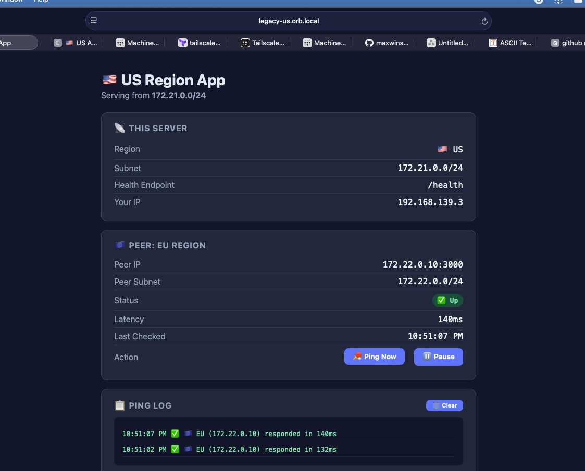
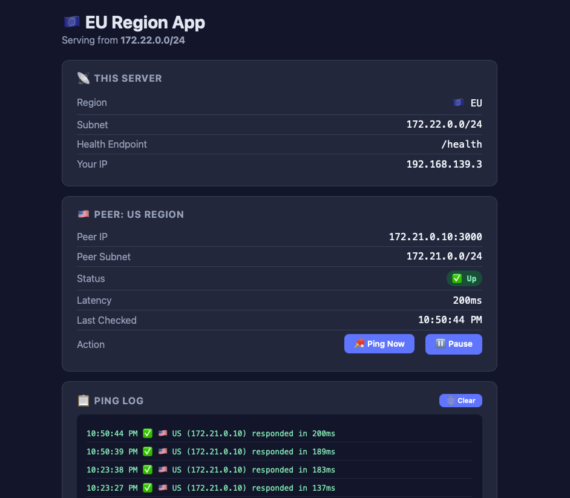
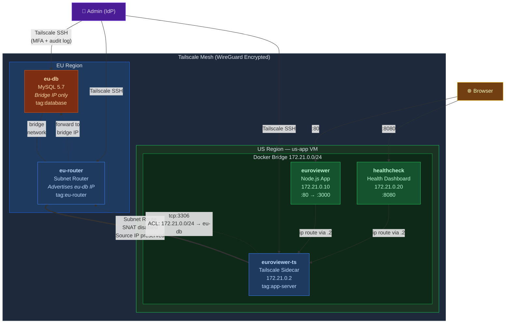

# Sovereign Mesh: Secure EU Data Access from US Services

**Project:** Tailscale Site-to-Site PoC — GDPR-Ready Cross-Region Connectivity  
**Prepared By:** Max Winslow | **Date:** March 2026

<p align="center">
  
  
</p>

---

## 1. Business Use Case

A US-based firm is landing new logos in the EU and preparing for GDPR audit and certification. To meet data residency requirements, they have deployed a **bare-metal MySQL instance in the EU** to keep customer data at rest within EU jurisdiction.

They have a phased migration plan to eventually move processing power to the EU, but they can't wait for that to begin serving customers. The current plan is for **US-based servers to retrieve data from this EU-based database**.

### Requirements

| Requirement | Detail |
|-------------|--------|
| **Encrypted transit** | All cross-region traffic must be encrypted end-to-end |
| **Source IP preservation** | Transit must preserve the original container source IP for auditability |
| **Identity-tied access** | Any human access to the EU VM must be audited and tied to identity via IdP |
| **Centralized ACLs** | Access control must be centrally managed, not scattered across firewall rules |
| **Zero-touch networking** | New US services and future EU services must "just work" when they come online — no manual firewall rules, route tables, or operational debugging |

---

## 2. The Problem: The "Manual Networking" Tax

Without a control plane, cross-region connectivity requires manually configured tunnels with hardcoded peer addresses on each VM. This approach breaks down as the firm scales:

* **Operational Toil:** Every new US service means manual `iptables` rules, route table updates, and firewall exceptions on both sides of the ocean. Two machines, no mechanism to verify they're in sync. As the firm onboards new US services and begins its phased EU rollout, this becomes untenable.

* **Visibility Blind Spots:** Standard subnet routers perform SNAT, rewriting container source IPs to the router's address. Cross-region traffic becomes unattributable to a specific service — a GDPR audit failure.

* **Slow Emergency Access:** Static SSH keys carry no identity context. Revoking access during an incident means editing `authorized_keys` on each VM manually, with no audit trail of who used what key and when.

* **Scaling Dread:** The firm can't afford the maintenance overhead of manually administering firewall rules, route tables, and security groups — or the administration overhead of tracking this work across growing infrastructure.

---

## 3. The Solution: Tailscale Identity Plane

We replace manual commands and static tunnels with a **centralized Tailscale control plane**. This provides one unified way to handle cross-region traffic, access control, and emergency access.

### Architecture



### Core Technical Approach

* **Site-to-Site Subnet Routing**
    * A Tailscale [Subnet Router](https://tailscale.com/kb/1019/subnets) (`eu-router`) advertises the EU database's bridge IP into the mesh. US containers route to it through a Tailscale sidecar (`euroviewer-ts`) on the Docker bridge.
    * **Result:** Containerized US services get cross-region database access without touching the host's underlying networking. New services on the same Docker bridge get connectivity automatically.

* **Source IP Preservation (`--snat-subnet-routes=false`)**
    * SNAT is disabled on both the EU router and the US Tailscale sidecar. The original container IP (172.21.0.x) is preserved end-to-end through the mesh to the MySQL server.
    * **Result:** Every query to the EU database is traceable to a specific container instance. Auditors can attribute traffic at the service level, not just the router level.

* **Grants-Based ACL Policy**
    * Access is defined in a centralized [ACL policy](https://tailscale.com/kb/1018/acls) managed via Terraform. Only the US app subnet (`172.21.0.0/24`) can reach EU MySQL (`tcp:3306`). All other traffic is default-deny.
    * **Result:** Adding a new US service to the Docker bridge automatically grants it database access — no firewall rule changes needed. The EU database node itself is ACL-isolated from all other Tailscale peers.

* **IdP-Backed SSH (Break-Glass)**
    * [Tailscale SSH](https://tailscale.com/kb/1193/tailscale-ssh) is enabled on all nodes, gating access through the company's IdP instead of static keys. Port 22 is closed everywhere.
    * **Result:** Access is MFA-protected, identity-scoped, and fully audited. No key distribution, no `authorized_keys` management.

---

## 4. Business Value

| Value | How |
|-------|-----|
| **Zero Manual Sync** | Routing policy and ACLs are defined once in Terraform and propagated to all nodes automatically. No per-VM edits, no opportunity for drift. |
| **"Just Works" Scaling** | New US services on the Docker bridge inherit mesh connectivity and ACL grants without config changes. Future EU services follow the same pattern. |
| **Auditability by Default** | Preserved source IPs mean every cross-region request is traceable to a specific container, not just a router address. GDPR evidence is built into the data plane. |
| **Faster Incident Response** | Break-glass access is a secure, audited IdP login — not a key hunt. Engineers can reach any node in seconds with a full identity trail. |
| **Infrastructure Agnostic** | The same overlay works on local VMs, cloud instances, or bare metal. No changes to the underlying network when connecting new isolated environments. |

---

## 5. Lab Implementation

### Infrastructure (Terraform + Ansible)

| Layer | Tool | Purpose |
|-------|------|---------|
| **VMs** | Terraform + OrbStack | 3 Ubuntu 22.04 VMs: `eu-db`, `eu-router`, `us-app` |
| **ACLs** | Terraform + Tailscale provider | Centralized grants, tag ownership, SSH rules, auto-approvers |
| **Configuration** | Ansible (4 plays) | Package install, Tailscale join, MySQL setup, Docker stack deploy |
| **App** | Docker Compose | 3-container stack on `us-app`: Tailscale sidecar, Node.js app, health dashboard |

### Data Layer

**MySQL** on `eu-db` — bound exclusively to the OrbStack bridge IP (not `0.0.0.0`):
- `app.famous_europeans` — 100 rows of historic European figures with flag emojis (UTF8MB4)
- Read-only `app` user for application queries

### Application Layer

**Euroviewer** (`http://us-app.orb.local`):
- `GET /` — Styled HTML table of 3 random famous Europeans with flag emojis
- `GET /json` — JSON response with source attribution (`"source": "eu-db"`)

**Health Dashboard** (`http://us-app.orb.local:8080`):
- 6 real-time connectivity checks (5-second refresh with animated countdown):
  - Ping euroviewer app container (Docker bridge)
  - Ping Tailscale sidecar (Docker bridge)
  - Ping EU database (through full subnet route path)
  - MySQL query (end-to-end data path)
  - HTTP /json endpoint (application layer)
  - HTTP / endpoint (HTML rendering)
- `GET /api` — JSON health status for programmatic consumption

### ACL Policy

```
Grants:
  172.21.0.0/24 → 192.168.0.0/16 : tcp:3306    (US app subnet → EU MySQL)
  autogroup:admin → * : *                        (admin full access)

SSH:
  autogroup:admin → all tagged nodes : root       (IdP check required)

Auto-Approvers:
  172.21.0.0/24 routes → tag:app-server
  192.168.0.0/16 routes → tag:eu-router
```

### Security Posture (Verified by `cmd/verify.sh`)

The verification script runs **22 checks** across 11 test groups:

| Test | What It Verifies |
|------|-----------------|
| VM Reachability | All 3 VMs respond |
| MySQL Bind | Bound to bridge IP only, not 0.0.0.0 |
| SSH Disabled | Port 22 closed on all VMs |
| Port Isolation | eu-db only exposes MySQL 3306 + tailscaled |
| Tailscale Status | Running on all 3 nodes |
| Docker Containers | All 3 containers running on us-app |
| eu-db ACL Isolation | eu-db cannot ping eu-router or us-app via Tailscale |
| eu-router → MySQL | Blocked by ACL (only app subnet allowed) |
| euroviewer-ts → MySQL | Blocked by ACL (Tailscale container itself denied) |
| euroviewer → MySQL | Allowed — proves the subnet route + ACL grant works |
| End-to-End HTTP | `/json` returns data, health dashboard API responds |

---

## 6. Project Structure

```
├── terraform
│   ├── orbstack.tf            # 3 Ubuntu VMs (eu-db, eu-router, us-app)
│   ├── tailscale.tf           # ACL policy, auth keys, auto-approvers
│   ├── locals.tf              # Docker CIDR constant
│   ├── provider.tf            # OrbStack + Tailscale providers
│   └── variables.tf           # Tailnet credentials
│
├── ansible/
│   ├── site.yml               # Orchestrator — imports 4 plays
│   ├── plays/
│   │   ├── eu-db.yml          # MySQL server + Tailscale SSH + seed data
│   │   ├── eu-router.yml      # Subnet router + IP forwarding + MSS clamp
│   │   ├── us-app.yml         # Docker stack + templates + healthcheck
│   │   ├── eu-db-routes.yml   # Return routes (CGNAT + Docker subnet)
│   │   ├── templates/
│   │   │   ├── docker-compose.yaml.j2
│   │   │   └── server.js.j2
│   │   └── files/
│   │       └── healthcheck.js
│   ├── generate-inventory.sh  # Reads terraform outputs → inventory.yml
│   ├── inventory.yml          # Generated host inventory
│   └── ansible.cfg            # OrbStack connection settings
│
├── cmd/
│   ├── verify.sh              # 22-check security & connectivity test suite
│   └── teardown.sh            # Docker down + Tailscale cleanup + terraform destroy
│
└── img/                       # Architecture diagram + screenshots
```

---

## 7. Setup

### Requirements

- macOS with [OrbStack](https://orbstack.dev)
- [Terraform](https://www.terraform.io/)
- [Tailscale](https://tailscale.com/) account + API key
- Docker (on Mac, for pulling images)

### Deploy

```sh
# 1. Provision VMs and Tailscale ACLs
terraform apply

# 2. Generate Ansible inventory from terraform outputs
bash ansible/generate-inventory.sh

# 3. Configure all VMs and deploy application stack
cd ansible && ansible-playbook site.yml
```

### Verify

```sh
cmd/verify.sh
```

### Teardown

```sh
cmd/teardown.sh
```

---

## 8. What's Next

- [ ] Deploy an Nginx reverse proxy on a separate Kubernetes cluster, routing to the US/EU Node.js apps via the tailnet using the [Kubernetes Operator](https://tailscale.com/kb/1236/kubernetes-operator) — demonstrating the mesh extends to K8s workloads without reconfiguring existing VMs
- [ ] Add a second EU sovereign service to demonstrate the "just works" scaling claim — new container on the Docker bridge, automatic mesh + ACL access
- [ ] Implement Tailscale [Funnel](https://tailscale.com/kb/1223/funnel) for public-facing access to the Euroviewer without exposing the underlying infrastructure


