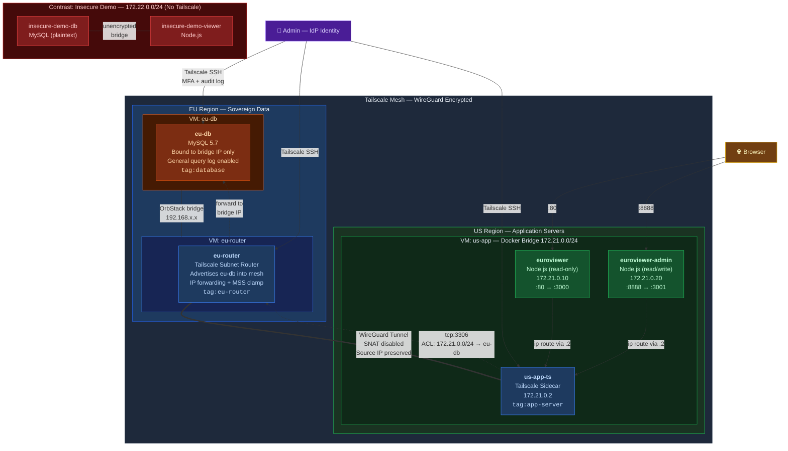
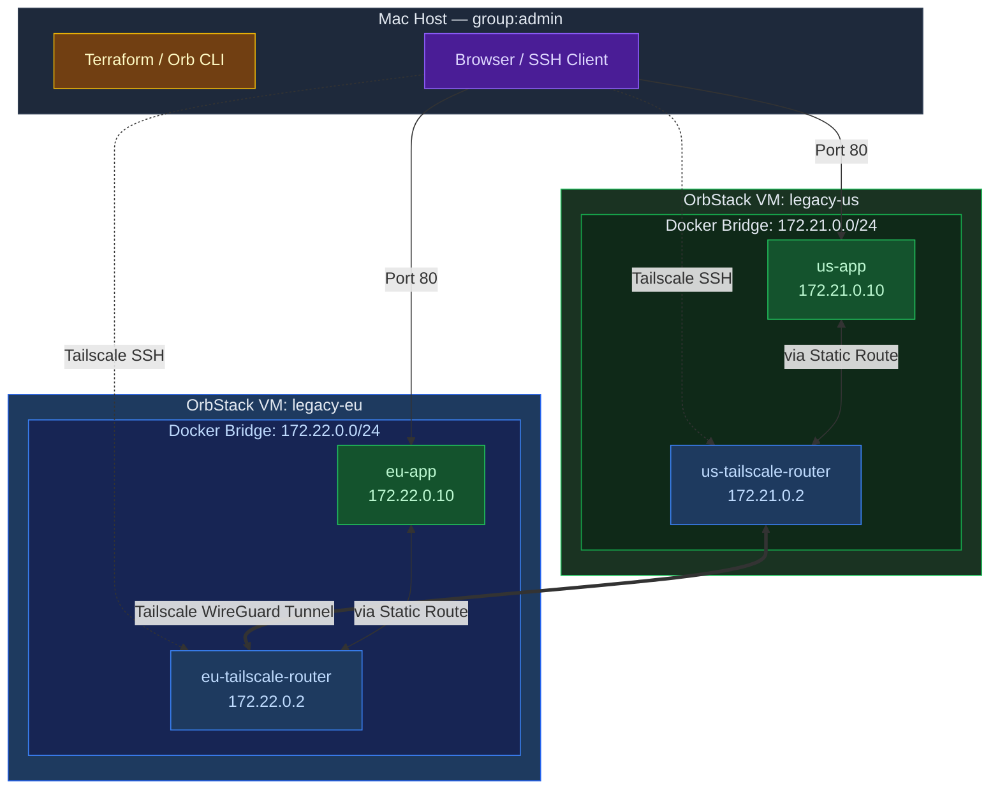

# Sovereign Mesh 2.0: Secure EU Data Access from US Services

**Project:** Tailscale Site-to-Site PoC — GDPR-Ready Cross-Region Connectivity  
**Prepared By:** Max Winslow | **Date:** March 2026

<!-- TODO: updated screenshots for v2.0 (euroviewer, admin panel, verify output) -->
<p align="center">
  
  
</p>

---

## 1. v2.0 Architecture

A US-based firm is pursuing new logos in the EU and preparing for GDPR audit certification. To meet data residency requirements, they've deployed a **bare-metal MySQL instance in a EU datacenter**. A phased migration to move processing to the EU is planned, but they can't wait — **US-based servers need to serve European data now**.

### v2.0 Requirements

| Requirement | Detail |
|-------------|--------|
| **Encrypted transit** | All cross-region traffic encrypted end-to-end — no plaintext SQL over the wire |
| **Source IP preservation** | Traffic to the EU database must be attributable to specific container source IPs |
| **Identity-tied access** | Direct access to any node must be auditable and tied to a user's IdP identity |
| **Centralized ACLs** | Access control managed in one place, not scattered across `iptables` and firewall rules |
| **Zero-touch networking** | New services "just work" on the mesh — no manual firewall rules, route tables, or debugging |

### Architecture Diagram



### How Tailscale Meets Each Requirement

* **Site-to-Site Subnet Routing**
    * `eu-router` ([Subnet Router](https://tailscale.com/kb/1019/subnets)) advertises the EU database's bridge IP into the mesh
    * US containers route to it through a Tailscale sidecar (`us-app-ts`) on the Docker bridge
    * New containers on the Docker bridge get mesh connectivity automatically — no config changes

* **Source IP Preservation** (`--snat-subnet-routes=false`)
    * SNAT disabled on both the EU router and US sidecar
    * Original container IPs (172.21.0.10, 172.21.0.20) preserved end-to-end to MySQL
    * Docker `userland-proxy: false` ensures real IPs at the Docker layer too
    * MySQL general query log records every connection with its true source IP

* **Grants-Based ACL Policy**
    * Centralized [ACL policy](https://tailscale.com/kb/1018/acls) managed via Terraform — default-deny
    * Only the US app subnet (`172.21.0.0/24`) can reach EU MySQL on `tcp:3306`
    * The EU database node is ACL-isolated from all other Tailscale peers
    * Adding a new US service to the Docker bridge automatically grants it database access

* **IdP-Backed SSH (Break-Glass)**
    * [Tailscale SSH](https://tailscale.com/kb/1193/tailscale-ssh) on all nodes — access gated through the company's IdP
    * Port 22 closed everywhere — no static keys, no `authorized_keys` management
    * Access is MFA-protected, identity-scoped, and fully audited

---

## 2. v1.0 — Where We Started

The [original project](https://github.com/maxwinslow-ts/tailscale-cse-take-home-project/tree/main) demonstrated the core Tailscale value proposition with a simpler topology:

* Two Ubuntu VMs (`legacy-us`, `legacy-eu`) on isolated OrbStack networks
* Each VM ran a Docker bridge with an identical containerized Node.js server
* A Tailscale subnet router container on each side bridged the two networks
* The demo proved cross-region connectivity, source IP preservation, and Tailscale SSH



### Why v1.0 Wasn't Enough

The v1.0 demo was a valid proof of concept, but it was an **incomplete stand-in for real-world enterprise topology**:

* **Pings between identical servers** aren't a realistic substitute for sending business-critical, potentially sensitive customer data across networks
* **No real database** — no data at rest to secure, no query logs to audit, no bind-address to harden
* **No encryption-in-transit evidence** — the demo asserted WireGuard encryption but never proved it with packet captures
* **No source IP proof under real load** — no MySQL processlist or general log to show distinct container IPs arriving at the database
* **Symmetric topology** — real-world enterprise networks aren't two identical boxes; they have dedicated database servers, routers, app tiers, and varying security postures

---

## 3. The Problem: The "Manual Networking" Tax

Without a control plane, this firm's cross-region connectivity requires manually configured tunnels with hardcoded peer addresses on each VM. This breaks down as they scale:

* **Operational Toil** — Every new US service means manual `iptables` rules, route table updates, and firewall exceptions on both sides. No mechanism to verify they're in sync.
* **Visibility Blind Spots** — Standard subnet routers perform SNAT, rewriting container source IPs. Cross-region traffic becomes unattributable to a specific service — a GDPR audit failure.
* **Slow Emergency Access** — Static SSH keys carry no identity context. Revoking access means editing `authorized_keys` on each VM manually, with no audit trail.
* **Scaling Dread** — The firm can't afford the maintenance overhead of manually administering firewall rules, route tables, and security groups across growing infrastructure.

---

## 4. Business Value

| Value | How |
|-------|-----|
| **Zero Manual Sync** | Routing policy and ACLs defined once in Terraform, propagated to all nodes. No per-VM edits, no drift. |
| **"Just Works" Scaling** | New containers on the Docker bridge inherit mesh connectivity and ACL grants automatically. |
| **Auditability by Default** | Preserved source IPs + MySQL general query log = every request traceable to a specific container. |
| **Faster Incident Response** | Break-glass access is an audited IdP login, not a key hunt. Full identity trail. |
| **Infrastructure Agnostic** | Same overlay works on local VMs, cloud instances, or bare metal. No underlying network changes needed. |

---

## 5. Lab Implementation

### Infrastructure

| Layer | Tool | Purpose |
|-------|------|---------|
| **VMs** | Terraform + OrbStack | 3 Ubuntu 22.04 VMs: `eu-db`, `eu-router`, `us-app` |
| **ACLs** | Terraform + Tailscale provider | Grants, tag ownership, SSH rules, auto-approvers |
| **Configuration** | Ansible (5 plays) | Package install, Tailscale join, MySQL setup, Docker stack, return routes |
| **App** | Docker Compose | 3-container stack on `us-app` + insecure contrast demo |

### Data Layer

**MySQL 5.7** on `eu-db` — bound to bridge IP only (not `0.0.0.0`):
- `app.famous_europeans` — 80+ historic European figures with flag emojis (UTF8MB4)
- General query log enabled at `/var/log/mysql/general.log` — records every connection with source IP
- `app` user (read-only) for the viewer, `appadmin` user (read/write) for the admin panel

### Application Layer

**Euroviewer** (`http://us-app.orb.local`) — read-only viewer:
- Displays 3 random famous Europeans with flag emojis
- `GET /json` — JSON with source attribution (`"source": "eu-db"`)
- Auto-refreshes every 5 seconds

**Euroviewer Admin** (`http://us-app.orb.local:8888`) — read/write admin panel:
- Same random display + form to add new entries
- Uses `appadmin` MySQL user with write permissions

**Insecure Demo** (`http://us-app.orb.local:8889`) — plaintext contrast:
- Local MySQL with `famous_americans` data on an isolated bridge (172.22.0.0/24)
- No Tailscale, no encryption — used by the verification suite to contrast encrypted vs. plaintext traffic

### ACL Policy

```
Grants:
  172.21.0.0/24 → 192.168.0.0/16 : tcp:3306    (US app subnet → EU MySQL only)
  autogroup:admin → * : *                        (admin full access)

SSH:
  autogroup:admin → all tagged nodes : root       (IdP check required)

Auto-Approvers:
  172.21.0.0/24 routes → tag:app-server
  192.168.0.0/16 routes → tag:eu-router
```

---

## 6. Verification Suite

The verification tool (`verify/`) is a Go CLI with 4 subcommands. Each proves a specific security requirement:

| Command | What It Proves |
|---------|---------------|
| `verify mysql-access` | Probes `eu-db:3306` from 6 vantage points — only US app containers (172.21.0.10, 172.21.0.20) are allowed. The Tailscale sidecar itself, `eu-router`, the `us-app` host, and the Mac host are all **blocked by ACL**. Also verifies MySQL is bound to bridge IP only and port 22 is closed. |
| `verify source-ip` | Connects from both app containers simultaneously, queries MySQL processlist to confirm **distinct source IPs** (172.21.0.10 vs 172.21.0.20) — not the host IP. Live-tails the MySQL general query log with color-coded output per container. |
| `verify transit-encrypt` | Packet capture comparison: captures plaintext SQL (SELECT, INSERT, passwords) on the **insecure demo bridge**, then captures the same traffic on the WireGuard tunnel — **only opaque encrypted UDP**. Side-by-side proof. |
| `verify test-ssh` | Confirms `sshd` is disabled on `eu-db`, port 22 not listening. Only `tailscale ssh` works — access requires IdP authentication. |

<!-- TODO: screenshot of verify output -->

---

## 7. Project Structure

```
├── orbstack.tf                # 3 Ubuntu VMs (eu-db, eu-router, us-app)
├── tailscale.tf               # ACL policy, auth keys, auto-approvers
├── locals.tf                  # Docker CIDR constant
├── provider.tf                # OrbStack + Tailscale providers
├── variables.tf               # Tailnet credentials
├── terraform.tfvars           # Tailnet secrets (gitignored values)
│
├── ansible/
│   ├── site.yml               # Orchestrator — imports all plays in order
│   ├── ansible.cfg            # OrbStack SSH connection settings
│   ├── generate-inventory.sh  # Reads terraform outputs → inventory.yml
│   ├── inventory.yml          # Generated host vars (IPs, auth keys)
│   └── plays/
│       ├── eu-db.yml          # MySQL + Tailscale SSH + seed data
│       ├── eu-router.yml      # Subnet router + IP forwarding + MSS clamp
│       ├── us-app.yml         # Docker + Tailscale sidecar + app containers
│       ├── eu-db-routes.yml   # Return routes (CGNAT + Docker subnet)
│       ├── insecure-demo.yml  # Plaintext contrast demo (no Tailscale)
│       ├── templates/
│       │   ├── docker-compose.yaml.j2
│       │   ├── server.js.j2
│       │   ├── admin.js.j2
│       │   └── insecure-compose.yaml
│       └── files/
│           ├── seed-europeans.sql
│           └── seed-americans.sql
│
├── verify/                    # Go CLI verification tool
│   ├── main.go                # Entrypoint + subcommand dispatch
│   ├── mysql.go               # mysql-access: ACL enforcement probes
│   ├── sourceip.go            # source-ip: processlist + query log tailing
│   ├── transit_encrypt.go     # transit-encrypt: packet capture comparison
│   ├── ssh.go                 # test-ssh: sshd disabled, Tailscale SSH only
│   ├── runner.go              # SSH command execution helpers
│   └── output.go              # Formatted terminal output
│
└── img/                       # Screenshots + diagrams
```

---

## 8. Setup

### Requirements

- macOS with [OrbStack](https://orbstack.dev)
- [Terraform](https://www.terraform.io/) + [Tailscale](https://tailscale.com/) account with API key
- [Ansible](https://docs.ansible.com/)
- [Go](https://go.dev/) (for running the verification suite)

### Deploy

```sh
# 1. Provision VMs and Tailscale ACLs
terraform apply

# 2. Generate Ansible inventory from terraform outputs
bash ansible/generate-inventory.sh

# 3. Configure all VMs and deploy application stack
cd ansible && ansible-playbook site.yml
```

### Verify

```sh
cd verify
go run . mysql-access        # ACL enforcement
go run . source-ip           # Source IP preservation
go run . transit-encrypt     # Encryption in transit
go run . test-ssh            # SSH access control
```

### Teardown

```sh
terraform destroy
```

---

## 9. What's Next

* **Onboarding new services** — Add a new container to the Docker bridge. It inherits mesh connectivity and ACL grants automatically. No firewall rules, no route tables.
* **GitOps for ACLs** — Manage the Tailscale ACL policy in version control. PR-based review for network policy changes with full audit trail.
* **CI/CD integration** — Tailscale auth keys and ACL policy managed as part of the deployment pipeline. Infrastructure changes are tested and applied automatically.
* **Kubernetes Operator** — Deploy an Nginx reverse proxy on a K8s cluster, routing to US/EU apps via the tailnet using the [Kubernetes Operator](https://tailscale.com/kb/1236/kubernetes-operator)
* **Tailscale Funnel** — Public-facing access to the Euroviewer via [Funnel](https://tailscale.com/kb/1223/funnel) without exposing underlying infrastructure


