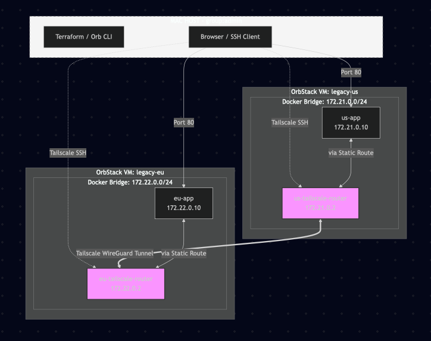

# Business Use Case: Secure Regional Connectivity PoC (🇺🇸/🇪🇺)

**Project:** Modernizing Legacy Infrastructure with Tailscale  
**Prepared By:** Max Winslow | **Date:** March 2026

<p align="center">
  
  
</p>

## 1. Project Overview (PoC)
**Goal:** Demonstrate secure, cross-region connectivity and "break-glass" access between two isolated legacy environments (US and EU) without manual VPN configuration.

* **Setup:** Two Ubuntu VMs (US and EU) each running a containerized Node.js application and a Tailscale Subnet Router.
* **Compliance Target:** Strict data residency and identity-based access logs.

---

## 2. The Problem: The "Manual Networking" Tax
The customer currently manages cross-region links and emergency access using manual `iptables`, `ip route` commands, and static SSH tunnels.

* **Operational Toil:** Managing network rules by hand leads to configuration drift. US and EU routing tables easily get out of sync, causing "ghost" connection issues that are hard to debug.

* **Fragile Site-to-Site Logic:** Building backup paths manually is complex. Without a mesh overlay, any change to the VM's network requires a manual update to the static tunnels.

* **Visibility "Blind Spots":** Manual NAT often masks source IPs. This makes it impossible to map traffic to specific containers, failing basic SOC2 audit requirements.

* **Slow Emergency Access:** Hand-delivering SSH keys and updating firewall rules during a "break-glass" event is too slow. It increases the risk of human error under pressure.

---

## 3. The Solution: Tailscale Identity Plane
We are replacing manual commands and static tunnels with a centralized Tailscale control plane. This provides one unified way to handle cross-region traffic and emergency access.

### Core Technical Plan

* **Site-to-Site Subnet Routing**
    * **The Fix:** We deploy a Tailscale container on each VM as a [Subnet Router](https://tailscale.com/docs/features/site-to-site). It bridges the isolated Node.js services across regions.

    * **Benefit:** This replaces manual `iptables` with a managed mesh. We get cross-VM connectivity without touching the host's underlying networking.

* **Audit-Ready Transparency (`--snat-subnet-routes=false`)**
    * **The Fix:** We disable SNAT on the routers to preserve original container IPs.

    * **Benefit:** This satisfies SOC2. Auditors can see exactly which specific Node.js instance accessed a remote resource, even across regions.

* **IdP-Backed SSH (Break-Glass)**
    * **The Fix:** We enable [Tailscale SSH](https://tailscale.com/docs/features/ssh) on the Ubuntu Hosts, tied directly to the company’s Identity Provider (IdP).

    * **Benefit:** We close public Port 22. Engineers get instant, MFA-protected access to the VM shell based on their identity, not a static, shareable key.

---

## 4. Business Value (The "Why")
* **Zero Manual Sync:** Centralizing policy in the Tailscale admin console stops "configuration drift" between regional VMs.

* **Reduced RTO (Recovery Time):** "Break-glass" is no longer a scramble for keys. It’s a secure, audited login tied to the IdP, allowing faster response to regional outages.

* **Auditability by Default:** Transparent routing provides a clear record of "who talked to what" for every regional request.

* **Infrastructure Agnostic:** This PoC proves we can connect legacy environments without re-architecting their existing VPC or local network settings.

# Lab Setup

<p align="center">
  
</p>

<!-- BEGIN_TF_DOCS -->
## Requirements

- Terraform
- Tailscale
- OrbStack
- Mac OS
- Docker (on Mac, for pulling images)

## Providers

| Name | Version |
|------|---------|
| <a name="provider_local"></a> [local](#provider\_local) | 2.7.0 |
| <a name="provider_orbstack"></a> [orbstack](#provider\_orbstack) | 3.1.2 |
| <a name="provider_tailscale"></a> [tailscale](#provider\_tailscale) | 0.28.0 |

## Resources

| Name | Type |
|------|------|
| [local_file.compose](https://registry.terraform.io/providers/hashicorp/local/latest/docs/resources/file) | resource |
| [local_file.server_js](https://registry.terraform.io/providers/hashicorp/local/latest/docs/resources/file) | resource |
| [orbstack_machine.legacy_nodes](https://registry.terraform.io/providers/robertdebock/orbstack/latest/docs/resources/machine) | resource |
| [tailscale_acl.main_acl](https://registry.terraform.io/providers/tailscale/tailscale/latest/docs/resources/acl) | resource |
| [tailscale_tailnet_key.router](https://registry.terraform.io/providers/tailscale/tailscale/latest/docs/resources/tailnet_key) | resource |

## Inputs

| Name | Description | Type | Default | Required |
|------|-------------|------|---------|:--------:|
| <a name="input_tailscale_admin_email"></a> [tailscale\_admin\_email](#input\_tailscale\_admin\_email) | Admin email for Tailscale ACL group | `string` | n/a | yes |
| <a name="input_tailscale_api_key"></a> [tailscale\_api\_key](#input\_tailscale\_api\_key) | Tailscale API Key for provider authentication | `string` | n/a | yes |
| <a name="input_tailscale_tailnet"></a> [tailscale\_tailnet](#input\_tailscale\_tailnet) | Tailscale Tailnet name for provider authentication | `string` | n/a | yes |

## Setup

First-time provisioning — creates VMs, pulls images, loads them, pushes files, and starts the stacks:

```sh
chmod +x ./cmd/*
./cmd/setup.sh
```

### Redeploy After Changes

Re-renders templates, pushes updated files, and restarts the stacks:

```sh
./cmd/redeploy.sh
```

### Teardown

Stops all containers and destroys the VMs:

```sh
./cmd/teardown.sh
```

---

## Verify Working Demo

```sh
./cmd/verify.sh
```

## Todos - Areas To Extend
- [ ] MYSQL on both networks communicating via [sidecar container](https://tailscale.com/blog/docker-tailscale-guide)
- [ ] Systemd Tailscale service on Host
- [ ] Connect with AWS VPC
- [ ] Connect to isolated Kubernetes services from VM containers ([via Operator](https://tailscale.com/docs/features/kubernetes-operator))


